# Solution Decision Tree

**Context**: Addressing dialogue duration and character consistency problems

---

## Decision Tree Diagram

```mermaid
flowchart TD
    Start[Problem: Dialogue Duration + Character Consistency]

    Start --> Q1{Generate dialogue as?}
    Q1 -->|Full script first| FullDialogue[Generate fullDialogue<br/>✅ CHOSEN]
    Q1 -->|Separate chunks| Chunks[Generate 3 chunks directly<br/>❌ NOT CHOSEN]

    FullDialogue --> Q2{Scene count?}
    Q2 -->|Dynamic based on duration| Dynamic[Calculate from targetDuration<br/>⏸️ NOT CHOSEN - Future]
    Q2 -->|Fixed for POC| Fixed[Fixed: 3 scenes × 8 sec<br/>✅ CHOSEN]

    Fixed --> Q3{How to break dialogue?}
    Q3 -->|LLM breaks naturally| LLM[CALL 1.5: LLM breaks at pauses<br/>🤔 OPTION A - TBD]
    Q3 -->|Rule-based split| Rules[Split by punctuation/words<br/>🤔 OPTION B - TBD]

    LLM --> Q4{Voice generation?}
    Rules --> Q4
    Q4 -->|Veo generates audio| VeoAudio[Use Veo generate_audio<br/>🤔 SIMPLER - TBD]
    Q4 -->|External TTS + Lipsync| External[ElevenLabs + Wav2Lip<br/>🤔 MORE COMPLEX - TBD]

    VeoAudio --> Q5{Character consistency?}
    External --> Q5
    Q5 -->|Frame chaining| Chain[Use image + last_frame<br/>✅ CHOSEN]
    Q5 -->|Reference images| Ref[Use reference_images<br/>🚫 BLOCKED: needs 16:9]

    Chain --> End[Proposed Solution]

    style Start fill:#f9f,stroke:#333,stroke-width:2px
    style FullDialogue fill:#9f9,stroke:#333,stroke-width:2px
    style Fixed fill:#9f9,stroke:#333,stroke-width:2px
    style Chain fill:#9f9,stroke:#333,stroke-width:2px
    style Chunks fill:#f99,stroke:#333,stroke-width:2px
    style Ref fill:#f99,stroke:#333,stroke-width:2px
    style End fill:#9ff,stroke:#333,stroke-width:3px
```



---

## Legend

- ✅ **CHOSEN** - Decision made, moving forward with this
- ❌ **NOT CHOSEN** - Decided against this option
- 🚫 **BLOCKED** - Can't use due to constraints
- ⏸️ **NOT CHOSEN - Future** - Skipping for POC, revisit later
- 🤔 **TBD** - Still deciding between options
- 💡 **Future Option** - Alternative approach to explore later

---

## Decision Summary

### Q1: Generate dialogue as?
**Chosen**: Full script first
**Reason**: Ensures narrative coherence across all scenes

### Q2: Scene count?
**Chosen**: Fixed (3 scenes × 8 sec)
**Reason**: Keep POC simple, dynamic scenes is future enhancement

### Q3: How to break dialogue?
**Status**: TBD
**Options**:
- A: LLM breaks naturally (more accurate, adds cost)
- B: Rule-based split (faster, might be awkward)

### Q4: Voice generation?
**Status**: TBD
**Options**:
- A: Veo generates audio (simpler workflow)
- B: External TTS + lipsync (more control, more complex)

### Q5: Character consistency?
**Chosen**: Frame chaining (image + last_frame)
**Blocked**: Reference images (requires 16:9, we need 9:16)

---

## Next Decision Points

1. **Test frame chaining manually** → Informs if Q5 solution works
2. **If frame chaining works** → Decide Q3 and Q4
3. **If frame chaining fails** → Reconsider Q5 alternatives

---

## Alternative Approach: Video Extension (Veo 3.1)

**Status**: 💡 **Future Option** - Not available in Replicate API

### What It Is
Veo 3.1 (via Gemini API) supports **video extension**:
- Generate initial video (8 seconds)
- Extend by +7 seconds up to 20 times
- Output is single continuous video (not separate clips)

### How It Would Work
```
1. Generate Scene 1 (8 sec)
   prompt: "Person saying: 'I know that fear feels overwhelming.'"

2. Extend with Scene 2 (+7 sec)
   video: Scene 1 output
   prompt: "Continue. Person saying: 'You're not alone.'"

3. Extend with Scene 3 (+7 sec)
   video: Scene 1+2 output
   prompt: "Continue. Person saying: 'God's love is constant.'"

Output: One 22-second continuous video
```

### Benefits Over Frame Chaining
✅ **Solves dialogue continuity** - No scene breaks, one continuous video
✅ **Solves character consistency** - Extension continues same video, guaranteed same character
✅ **Simpler output** - Platform gets 1 file instead of 3 clips to stitch
✅ **No breaking dialogue needed** - Can use full natural dialogue flow

### Drawbacks
❌ **Not available in Replicate API** - Would require switching to Gemini API
❌ **Requires API migration** - video-generator.ts rewrite
❌ **Different authentication** - New API keys, different pricing
❌ **Fixed +7 sec extension** - Less flexible than choosing 4/6/8 sec

### Decision
**Defer to future** - Document as alternative if frame chaining doesn't work well enough

### When to Reconsider
- If frame chaining produces poor character consistency
- If dialogue breaks feel too jarring
- If willing to migrate from Replicate to Gemini API

---

See `workflow-problems-and-solutions.md` for full context.
