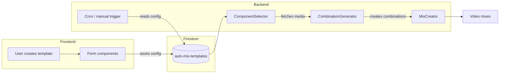
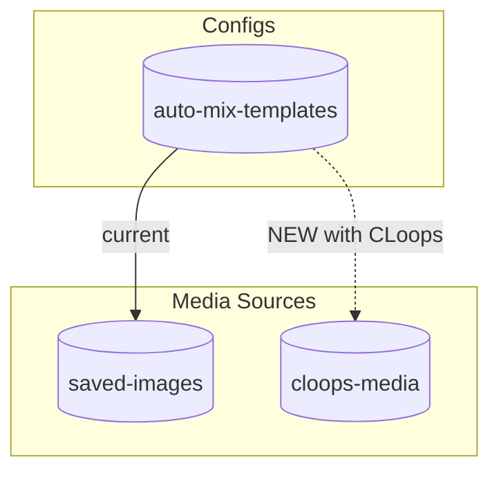
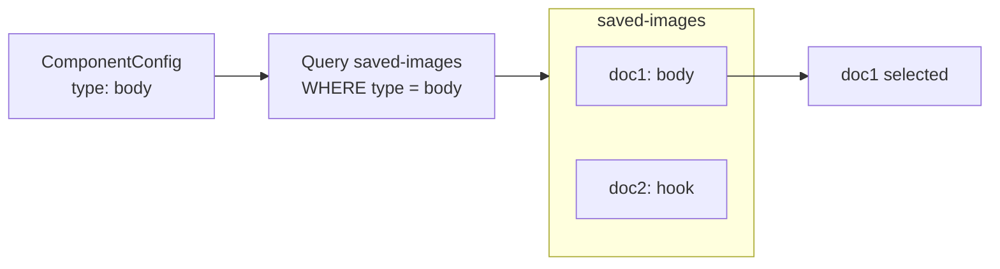
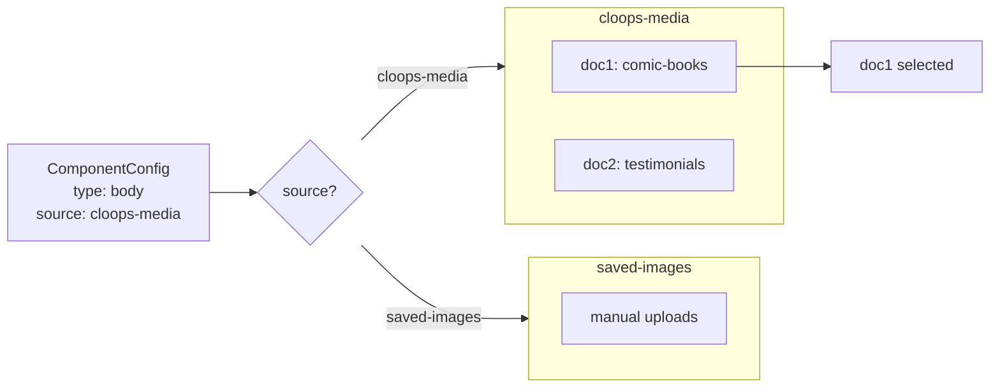

# AutoMix System Diagrams

## A. The Data Flow

How a template goes from creation → storage → execution → output.



**Story:** User builds template in UI → saves to Firestore → backend reads it → fetches media → generates mixes.

---

## B. The Collections Map

What collections exist, what's in them, how they relate.



### Collection Schemas

**auto-mix-templates** (the config)
```json
{
  "id": "template123",
  "name": "My Campaign",
  "components": [
    {
      "type": "body",
      "source": "cloops-media",
      "selectedImageIds": [],
      "conditions": [{ "field": "sourceTemplate", "operator": "==", "value": "comic-books" }]
    }
  ]
}
```

**saved-images** (manual uploads)
```json
{
  "id": "abc123",
  "type": "body",
  "language": "english",
  "tags": ["promo"],
  "image": [{ "fileURL": "...", "fileName": "..." }]
}
```

**cloops-media** (CLoops output) — NEW
```json
{
  "id": "xyz789",
  "sourceTemplate": "comic-books-standard",
  "contentType": "images",
  "language": "english",
  "tags": ["bible", "comic"],
  "media": [{ "fileURL": "...", "fileName": "..." }]
}
```

---

## C. The Component Sourcing

How a Body component gets its actual images.

### Current (No CLoops)



Collection is implicit. `type: body` means query `saved-images` where `type == body`.

### With CLoops (NEW)



**The difference:** `source` field explicitly routes to the correct collection.

---

## Summary

| Concept | Current | With CLoops |
|---------|---------|-------------|
| Media source | `saved-images` only | `saved-images` OR `cloops-media` |
| Source selection | Implicit (hardcoded) | Explicit (`source` field) |
| Role assignment | `type` field in saved-images | `type` field in ComponentConfig |
| CLoops role | N/A | Just outputs media, no role |
