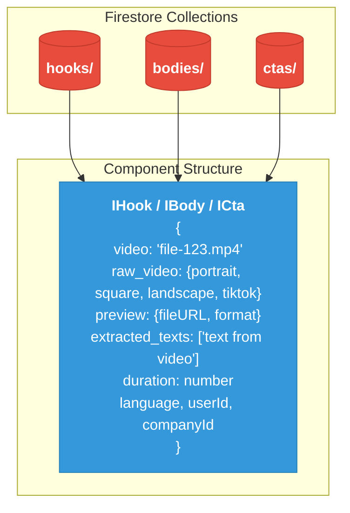
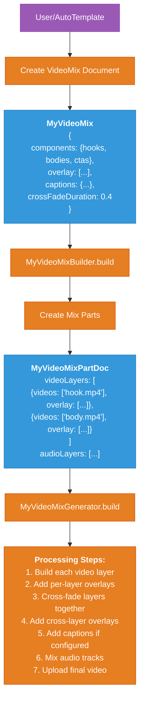
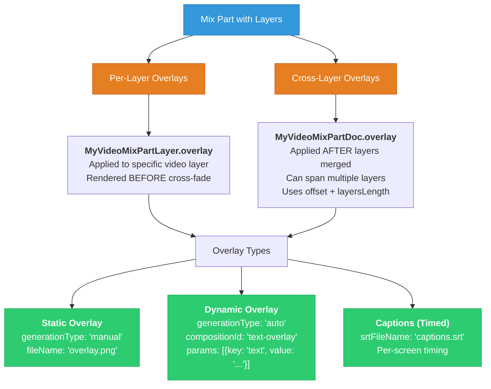
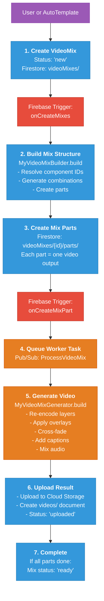
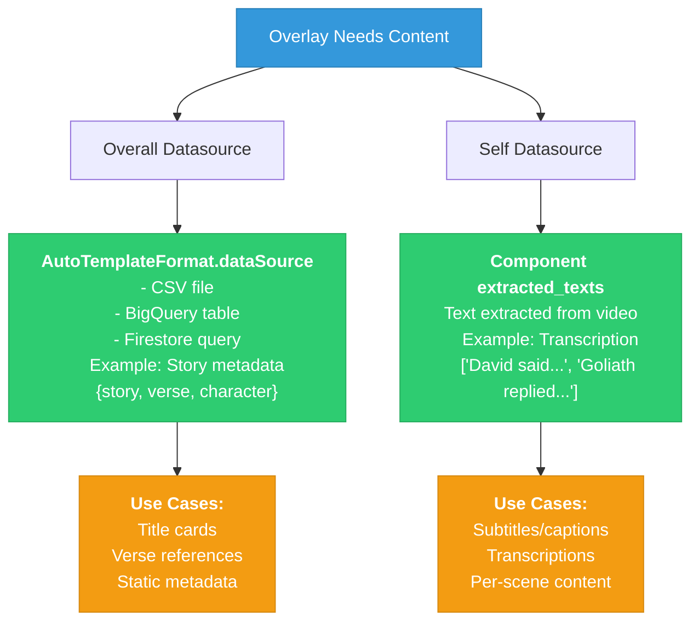
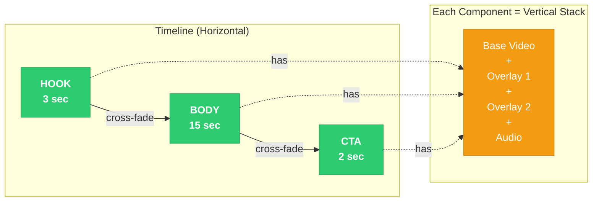
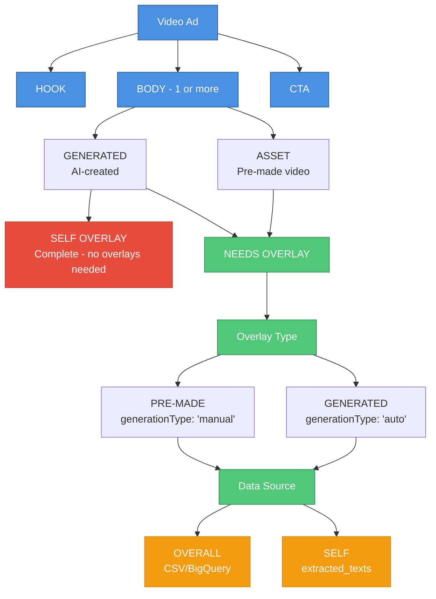

# AdLoops System Diagrams

> Visual reference for AdLoops architecture. Companion to `adloops-system-analysis.md`.
>
> **Last validated:** 2026-01-09 against `_projects/_adloops/` codebase

---

## 1. Component Data Structure

Components (hooks, bodies, ctas) are just video files with metadata.



---

## 2. Mix Creation Flow

Overlays are defined at mix/part level, not stored with components.



---

## 3. Overlay Processing

Two types of overlays with different application timing.



---

## 4. Processing Pipeline

Complete flow from trigger to final video.



---

## 5. Data Sources

Where overlay content comes from.



---

## 6. Vertical Stack Model

Each component is processed as a vertical stack of layers.



**Processing Order per Component:**
```
1. Load base video
2. Apply overlay 1 (on top)
3. Apply overlay 2 (on top)
4. Apply overlay n...
5. Mix audio layers
= Complete component ready for merge
```

**After all components:**
```
6. Cross-fade merge (Hook → Body → CTA)
7. Apply cross-layer overlays
8. Add captions (timed)
9. Final audio mix
10. Upload
```

---

## 7. Video Ad Structure

Decision tree for component processing.



---

## Quick Reference

| Concept | Technical Reality |
|---------|-------------------|
| Component Types | All are just video files (IHook/IBody/ICta) |
| Where Overlays Defined | At mix/part level, not component level |
| GENERATED vs ASSET | Workflow distinction only |
| Overlay Types | `generationType: "manual" \| "auto"` |
| Data Sources | Overall (dataSource) vs Self (extracted_texts) |
| Per-Screen Timing | Only for captions (SRT files) |
